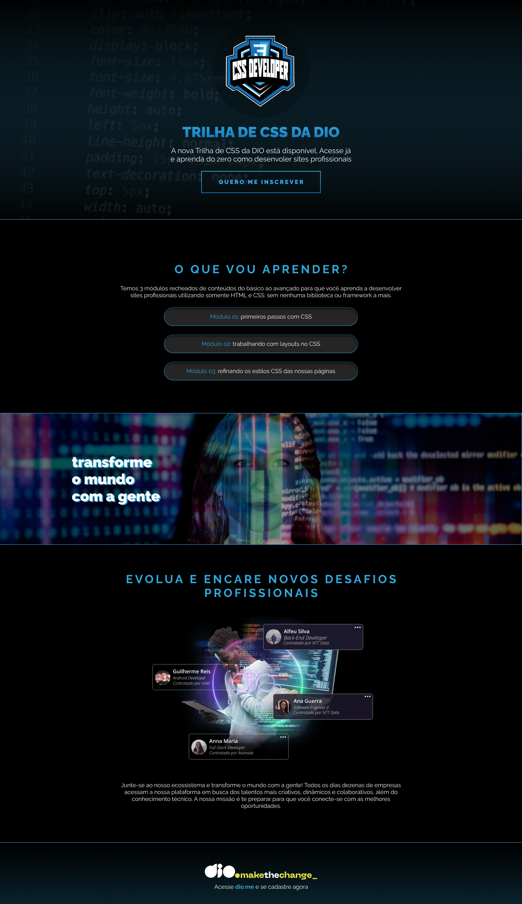

<h1 align="center">Desafio 01: Criando sua primeira Landing Page com HTML e CSS:</h1>

## 📲 View the project here
<a href="https://devgustavus.github.io/WebDesign-DIOLandingPage/">https://devgustavus.github.io/WebDesign-DIOLandingPage/</a>

## 📖 About the project

Bem vindo(a) ao primeiro desafio da Trilha de CSS da DIO! Nela, você vai construir sua primeira Landing Page com HTML e CSS, colocando em prática os fundamentos do CSS,
as propriedades básicas da linguagem de estilização, além de trabalhar com as unidades de medidas relativas e absolutas que aprendemos ao longo da trilha.

[Clique aqui](https://micheleambrosio.github.io/dio-trilha-css-desafio-01/) para acessar o resultado final da Landing Page criada a partir do desafio!



Para você realizar o desafio, basta fazer um **fork** para o seu GitHub e começar a mexer no projeto.
Dentro da pasta *main*, você vai encontrar todas as imagens e o arquivo HTML, contendo a estrutura básica da sua página, faltando apenas
realizar a estilização da sua página. É necessário que você faça toda a parte responsável por interligar sua página HTML com suas folhas
de estilo para que o resultado da estilização funcione.

[Link do Figma](https://www.figma.com/file/3PiokoJj9IhGDnNiWAJbz7/DIO---Desafio-01?node-id=2%3A6) contendo o protótipo do desafio para
que você possa se basear.

*Observações: para aplicar os textos em gradiente, utilize a propriedade CSS background-clip, porém, para funcionar em alguns navegadores,
é necessário utilizar a propriedade -webkit-background-clip: text;*

Caso tenha alguma dúvida, ou queira comparar o resultado do desafio que você fez, nós temos o site finalizado na branch *final*. Basta alterar a branch do projeto
utilizando o comando `git checkout final` no seu terminal.

## 🦾 Technologies used
<div style="display: flex;">
  


</div>

## 🤔 What i learned
- I learned more about what i already know, but i could train more about UI/UX in this Bootcamp Challenge.

## 👽 How to clone this project
````bash
    # Select where you want to clone
    $ cd ~/Documents/WHERE_YOU_WANT
````

````bash
    # Clone the project
    $ git clone https://github.com/DevGustavus/REPOSITORY_NAME.git
````

````bash
    # Check if cloning worked fine
    $ cd ~/Documents/DIRECTORY_LOCATION
    $ ls
````
